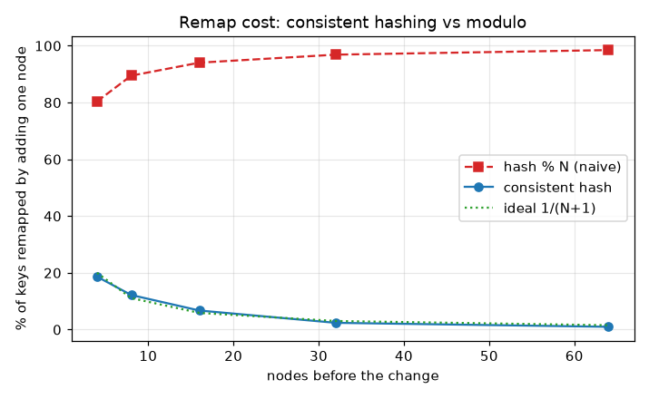
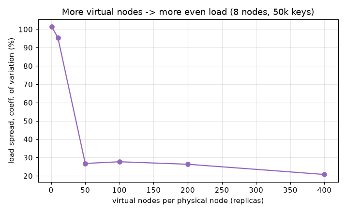

# Benchmarks

Produced by `bench/benchmark.py`, reproducible on any machine:

```
python bench/benchmark.py
```

It writes the graphs below and `bench/results/summary.json`. The comparison baseline
is the naive approach everyone reaches for first - `hash(key) % N` - which is the
honest thing to measure against, since consistent hashing exists precisely to fix its
remap behavior.

## Remap cost: the whole point



Percentage of 20,000 keys that move when you add **one** node:

| Nodes before | consistent hash | `hash % N` | ideal 1/(N+1) |
|:------------:|:---------------:|:----------:|:-------------:|
| 4 | 18.7% | 80.4% | 20.0% |
| 8 | 12.2% | 89.5% | 11.1% |
| 16 | 6.7% | 94.1% | 5.9% |
| 32 | 2.4% | 96.9% | 3.0% |
| 64 | 1.0% | 98.5% | 1.5% |

This is the graph that justifies the whole library. Consistent hashing tracks the
ideal `1/(N+1)` curve closely - adding a node to a 64-node cluster moves about 1% of
keys. The naive modulo approach moves **almost everything** on every change (80-98%),
which in production means a near-total cache miss storm or a full data reshuffle every
time you scale. That's the difference between "add a node at peak traffic" and "never
resize during business hours."

## Load distribution vs virtual nodes



Coefficient of variation of per-node load (lower = more even), 8 nodes, 50,000 keys:

| Replicas / node | Load spread (CoV) |
|:---------------:|:-----------------:|
| 1 | 101% |
| 10 | 95% |
| 50 | 27% |
| 100 | 28% |
| 200 | 26% |
| 400 | 21% |

With one point per node the load is wildly uneven - you're just hoping the handful of
hashes land well. Virtual nodes are what make it fair: by ~50-200 replicas the spread
settles into the 20-27% range, and pushing to 400 tightens it further. This is the
concrete reason the default is 100+ replicas, not 1.

## Lookup throughput

| Metric | Value |
|--------|-------|
| Lookups | 100,000 |
| Total time | ~0.93 s |
| Throughput | ~107,000 lookups/sec |
| Per lookup | ~9.3 us |

Lookup is a binary search over the sorted ring positions, so it stays fast even with
50 nodes x 200 virtual nodes = 10,000 points on the ring. ~9 microseconds per lookup
in pure Python; the C# and Java ports use `SortedDictionary`/`TreeMap` and are faster
still. That's the price of the nice remap behavior above, and it's cheap.

## Reading these together

The remap graph is the benefit; the throughput number is the cost. You give up a
binary search per lookup (single-digit microseconds) and get, in exchange, membership
changes that touch ~1/N of your keys instead of all of them. For anything that shards
state across a changing set of nodes, that's a trade you take every time.
