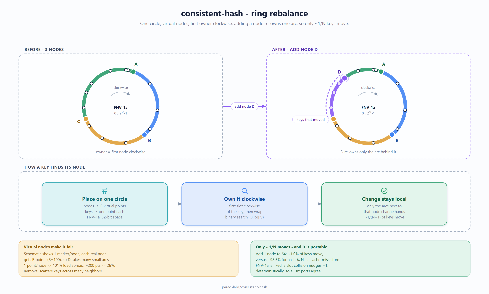

# consistent-hash: design, trade-offs, and non-goals

Status: accepted
Author: Parag Sawant

Notes on why this library looks the way it does. Consistent hashing is one of those
things that's simple once you've seen it and easy to get subtly wrong the first
time, so this is the reasoning I'd want a reviewer to push back on.

## Problem and goals

When you shard anything across N nodes, the naive `hash(key) % N` works right up
until N changes - then almost every key moves and you've effectively cold-started
your cache or reshuffled your whole dataset. Consistent hashing fixes that: a
membership change moves only the keys near the node that joined or left. The goals:

1. Adding or removing a node remaps only ~1/N of keys, not all of them.
2. Load spreads evenly across nodes, and stays even as membership changes.
3. The same behavior in Python, C#, and Java - identical ring placement for the same
   input - so it's a shared contract, not three subtly different implementations.

*(A fuller static companion to the README's inline [Mermaid sketch](README.md#how-it-works): the FNV-1a ring, the first-owner-clockwise rule, and the single arc that changes hands when a node joins - so only ~1/N keys move.)*

Before the redraw - the earlier version of this diagram

## Key design decisions

**Virtual nodes (replicas).** Each physical node is placed at many points on the
ring, not one. With a single point per node the load is badly lumpy (the benchmark
shows a ~100% coefficient of variation) because you're at the mercy of where three
or four hashes happen to land. With a couple hundred virtual nodes the spread tightens
to ~20-27%. Virtual nodes also make removal graceful: a departing node's keys scatter
across many neighbors instead of dumping entirely onto the next node clockwise.

**FNV-1a (32-bit) as the hash.** I deliberately did not use each language's built-in
string hash, because Python, Java, and .NET all hash strings differently (and
Python's is randomized per process). FNV-1a is tiny, has no dependencies, and
produces the same value everywhere, so a given node lands at the same ring position
in all three ports. The tests pin known FNV vectors to lock that down. The trade-off
is that FNV is not a cryptographic hash - that's fine here, we need spread, not
collision resistance.

**A sorted array of ring positions with binary search for lookup.** Lookup is "first
position clockwise from the key," which is a binary search over the sorted slots -
O(log V) where V is total virtual nodes. Rebuilding the sorted array on add/remove is
O(V log V), which is the cost I chose to pay: membership changes are rare, lookups are
hot, so I optimized the lookup path and kept mutation simple and obviously correct.

## Trade-offs I made on purpose

- **Rebuild-on-mutation instead of an incremental structure.** A balanced tree would
  make add/remove O(log V) too, but the sorted-array approach is simpler to read and
  lookups stay cache-friendly. Given membership changes are infrequent, this is the
  right call for a reference implementation. If you were adding/removing nodes
  constantly, a tree (or the C#/Java `SortedDictionary`/`TreeMap` used in those ports)
  is the better structure - and those ports do exactly that.
- **Uniform replicas, no explicit weights.** Every node gets the same number of
  virtual nodes. You can approximate a bigger node by handing it more replicas, but
  there's no first-class weight parameter. Called out as a non-goal.
- **Collision handling nudges deterministically.** On the rare hash collision between
  two virtual-node slots, I probe forward by one until free, so every replica is
  placed and the result is still deterministic. This keeps placement identical across
  the three languages.

## Non-goals

- **Not a distributed system.** This is the ring data structure, not a cluster.
  There's no membership gossip, failure detection, health checking, or a daemon that
  rebalances anything. Wiring it into a real cluster is the caller's job.
- **No first-class weighting on the ring.** The ring uses uniform replicas; for
  weighted placement, use the rendezvous strategy (see below).
- **No replication/consistency guarantees beyond selecting replica *targets*.**
  `get_replicas` tells you which N nodes should hold a key; it does not replicate
  anything or reason about quorums.

## The strategy family

The ring is the classic answer, but "consistent hashing" is really a family of
algorithms that trade memory, lookup cost, balance, and disruption differently. The
library implements five behind one idea - *given a key, pick a node, and move as few
keys as possible when membership changes* - so you can pick the one that fits:

| Strategy | Origin | Lookup | State | Best at |
|----------|--------|--------|-------|---------|
| **Ring + virtual nodes** | Karger et al. '97 / Dynamo | O(log V) | sorted ring | the general default; replica selection |
| **Rendezvous (HRW)** | Thaler & Ravishankar '98 | O(N) | none | weights, tiny clusters, no ring to rebuild |
| **Jump** | Lamping & Veach '14 | O(ln N) | none | huge speed, minimal memory, append-only buckets |
| **Maglev** | Google '16 | O(1) | lookup table | near-perfect balance with a single array index |
| **Bounded-load** | Google '17 | O(log V) amortized | ring + counts | hard cap on any node's share (anti-hot-spot) |

**Rendezvous (highest random weight).** Score every node for the key with a hash of
`node#key` and take the max. No ring, no rebuild, and weights are first-class: a
heavier node simply scores higher more often. The cost is O(N) per lookup, which is
fine for the small-N case (a handful of shards) where it shines. Removing a node only
moves the keys that scored it first - everyone else's max is unchanged.

**Jump.** Lamping & Veach's trick computes a bucket in the range `[0, N)` with no
state at all - just a short loop over a seeded LCG. It's the fastest and smallest of
the five, but the buckets are an ordered range: you can grow or shrink at the tail,
not pull an arbitrary node out of the middle without reshuffling the tail. Great for
"N mostly grows" systems (sharded storage that scales out).

**Maglev.** Build a fixed prime-sized permutation table once; every node claims table
slots in a deterministic interleaving. Lookups are a single array index, balance is
tighter than the ring, and losing a node only rewrites its slots. The table costs
memory (a prime a few times the node count) and a rebuild on membership change - the
price for O(1) lookups and excellent spread.

**Bounded-load.** The ring's one weakness is a *hot* node - a skewed key distribution
can overload one shard even with even hashing. Google's bounded-load variant caps any
node at `ceil((1 + epsilon) * keys / nodes)`; when the clockwise owner is full, the
key overflows to the next node under cap. It keeps consistent hashing's minimal-remap
property while guaranteeing no node exceeds its fair share by more than `epsilon`. The
trade-off is that placement now depends on load, so it's stateful and order-sensitive.

**Weighting is no longer a non-goal.** The ring still uses uniform replicas, but
rendezvous gives first-class integer weights, which is the cleaner place for it.

**One hash, one contract.** Every strategy uses FNV-1a - 32-bit for the ring's slots,
64-bit for the strategies that need a wider space (jump's LCG seed, Maglev's table
offsets, rendezvous scores). Because the hashes are fixed and portable, the golden
vectors in `conformance/` pin each strategy's placement so the Go, Rust, Python, C#,
Java, and TypeScript ports agree byte-for-byte. The one exception is *weighted*
rendezvous: it uses a logarithm, which rounds differently per language, so only
unweighted placement is in the cross-language vectors (weighting is tested per port).

## Benchmarks

See `BENCHMARKS.md`. Short version: adding one node to a 64-node cluster remaps under
1% of keys (versus ~98% for `hash % N`), tracking the ideal 1/(N+1) curve closely;
~200 virtual nodes keep load spread within ~20-27%; and lookups run at ~100k/sec in
pure Python.
