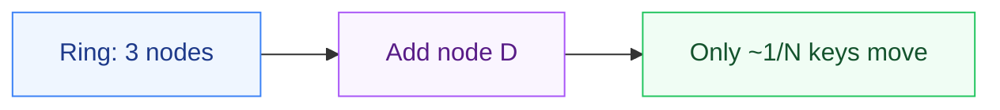
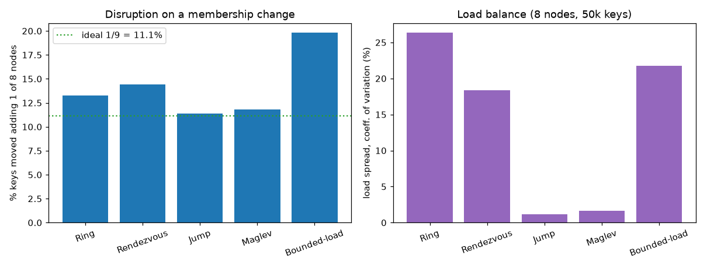

# consistent-hash

Five consistent-hashing strategies - a ring with virtual nodes, rendezvous (HRW),
jump, Maglev and bounded-load - implemented in **six languages** with identical
placement, proven byte-for-byte by a shared set of golden vectors. Plus an interactive
visualizer so you can watch what "only ~1/N keys move" actually looks like.

[](https://github.com/parag-labs/consistent-hash/actions/workflows/tests.yml)


**▶ [Live visualizer](https://parag-labs.github.io/consistent-hash/)** — add and remove
nodes, switch strategies, and watch the disruption meter and per-node load react.

## Why

The first time you shard anything - cache servers, queue partitions, database
replicas - `hash(key) % N` looks fine, until you add or remove a node and suddenly
almost every key maps somewhere new and your cache hit rate falls off a cliff.
Consistent hashing is the standard fix. But it's not one algorithm - it's a family,
and which member you want depends on whether you're optimizing for memory, lookup
speed, load balance, or a hard cap on hot nodes. I kept re-deriving these from memory,
so I wrote one clean version of each that I trust and can point people to.

## The five strategies

| Strategy | Origin | Lookup | Best at |
|----------|--------|:------:|---------|
| **Ring + virtual nodes** | Karger et al. '97 / Dynamo | O(log V) | the general default; replica selection |
| **Rendezvous (HRW)** | Thaler & Ravishankar '98 | O(N) | weights, small clusters, no ring to rebuild |
| **Jump** | Lamping & Veach '14 | O(ln N) | huge speed, minimal memory, append-only buckets |
| **Maglev** | Google '16 | O(1) | near-perfect balance with a single array index |
| **Bounded-load** | Google '17 | O(log V) | a hard cap on any node's share (anti-hot-spot) |

The benchmarks below put real numbers on those trade-offs. Full write-up of each in
**[DESIGN.md](DESIGN.md)**.

## How it works



Keys and nodes are hashed onto the same space; a key is owned by the first node found
clockwise (ring), or the highest-scoring node (rendezvous), or a bucket from a seeded
loop (jump), or a table slot (Maglev). When a node leaves, only a small, bounded set of
keys move - never the whole keyspace, the way `hash % N` would.

```python
from hashring import HashRing
from strategies import Rendezvous, JumpHash, Maglev, BoundedLoad

ring = HashRing(["cache-a", "cache-b", "cache-c"], replicas=200)
ring.get("user:42")                 # -> the node that owns this key
ring.get_replicas("user:42", 3)     # -> 3 distinct nodes for redundancy
ring.add("cache-d")                 # only ~1/4 of keys move, not all of them

Rendezvous(["a", "b", "c"]).get("user:42")     # weighted-capable, no ring state
JumpHash(["a", "b", "c"]).get("user:42")        # O(1) memory
Maglev(["a", "b", "c"]).get("user:42")          # single array index
BoundedLoad(["a", "b", "c"]).get("user:42")     # capped, no hot nodes
```

The hash is FNV-1a - 32-bit for the ring's slots, 64-bit for the strategies that need
a wider space. It's tiny and produces the same value in every language, which is what
lets the six ports agree.

## Six languages, one behavior

| Language | Run | Conformance |
|----------|-----|:-----------:|
| Python | `cd python && PYTHONPATH=src pytest -q` | ✓ |
| Go | `cd go && go test ./...` | ✓ |
| Rust | `cd rust && cargo test` | ✓ |
| C# (.NET 10) | `cd csharp && dotnet test` | ✓ |
| Java (17+) | `cd java && mvn test` | ✓ |
| TypeScript | `cd web && npm test` | ✓ |

Every port ships a conformance test that replays the golden placements in
**[conformance/vectors.json](conformance/)** - for a fixed set of nodes and keys, the
exact node each strategy assigns each key. If any language disagrees, CI goes red. That
turns "the ports behave the same" from a claim into a checked fact.

## Numbers

Measured, reproducible (`python bench/strategies.py`), full detail in
**[BENCHMARKS.md](BENCHMARKS.md)**:



Jump and Maglev give the tightest load (~1-2% spread) and near-ideal disruption; the
ring gives the fastest lookups; rendezvous is O(N) but weight-aware; bounded-load
trades a little disruption for a hard anti-hot-spot cap.

## Layout

```
consistent-hash/
├── python/         reference implementation + the strategy family + pytest
├── go/             Go port (all five strategies)
├── rust/           Rust crate (all five strategies)
├── csharp/         .NET 10 port
├── java/           JDK 17+ port (Maven)
├── web/            TypeScript core + the interactive visualizer (Vite/React)
├── conformance/    golden vectors + generator; the cross-language contract
├── bench/          benchmark.py (vs hash % N) and strategies.py (head to head)
├── DESIGN.md       why each algorithm, and the trade-offs
└── BENCHMARKS.md   reproducible numbers
```

Part of [parag-labs](https://github.com/parag-labs) - small, focused tools for building systems you can trust.
