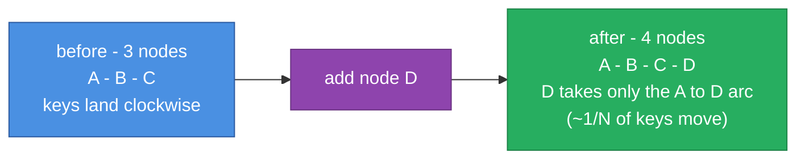

# consistent-hash

A consistent-hash ring with virtual nodes, in Python, C#, and Java - the same
behavior in all three, down to identical ring placement for the same input.

## Why

The first time you shard anything - cache servers, queue partitions, database
replicas - `hash(key) % N` looks fine, until you add or remove a node and suddenly
almost every key maps somewhere new and your cache hit rate falls off a cliff.
Consistent hashing is the standard fix, and I kept re-deriving it from memory, so I
wrote one clean version I trust and can point people to.

## How it works



Keys and nodes are hashed onto the same circular space. A key is owned by the first
node found clockwise from the key's position. When a node leaves, only the keys
between it and its predecessor move - everything else stays put. Each physical node
is placed at many points on the ring (virtual nodes / replicas), which smooths out
the load so no single node gets an unfair share and a departing node's keys spread
across many neighbors instead of landing on one.

```python
from hashring import HashRing

ring = HashRing(["cache-a", "cache-b", "cache-c"], replicas=200)
ring.get("user:42")                 # -> the node that owns this key
ring.get_replicas("user:42", 3)     # -> 3 distinct nodes for redundancy

ring.add("cache-d")                 # only ~1/4 of keys move, not all of them
```

The hash is FNV-1a (32-bit), chosen because it's tiny and produces the same value
in every language - the tests pin known FNV vectors so the Python, C#, and Java
rings place a given node at the same position.

## Three languages, one behavior

| Language | Tests | Run |
|----------|:-----:|-----|
| Python | 13 | `cd python && pytest -q` |
| C# (.NET 10) | 13 | `cd csharp && dotnet test` |
| Java (17+) | 13 | `cd java && mvn test` |

The suites prove the properties that matter: even distribution across virtual
nodes, that adding a node remaps only a small fraction of keys (and only onto the
new node), that removing a node moves only its own keys, and distinct replica
selection. `test_churn` adds a rebalance-storm stress test - hundreds of random
add/remove operations - that asserts ownership never dangles and a single change
never moves more than a bounded fraction of keys.

## Design notes and numbers

- **[DESIGN.md](DESIGN.md)** - why virtual nodes, why FNV-1a, the sorted-array-vs-tree
  trade-off, and the non-goals (it's the ring data structure, not a cluster).
- **[BENCHMARKS.md](BENCHMARKS.md)** - measured remap cost vs plain `hash % N`, load
  distribution vs replica count, and lookup throughput, with graphs. Reproduce with
  `python bench/benchmark.py`.

## Known limitations

- **In-process, not a service.** This is the ring data structure, not a running
  cluster - there's no membership gossip, health checking, or rebalancing daemon.
- **Weighted nodes aren't first-class.** You can approximate a bigger node by giving
  it more replicas, but there's no explicit weight parameter yet.

## Layout

```
consistent-hash/
├── python/         reference implementation (ring + virtual nodes) + pytest suite
├── csharp/         .NET 10 port - HashRing.cs + the stress suite
├── java/           JDK 17+ port (Maven)
├── bench/          benchmark.py - remap fraction vs the naive hash % N
├── docs/diagrams/  architecture diagrams
├── DESIGN.md       virtual nodes, remap-on-membership-change, the trade-offs
└── BENCHMARKS.md   reproducible numbers
```


Part of [parag-labs](https://github.com/parag-labs) - small, focused tools for building systems you can trust.
